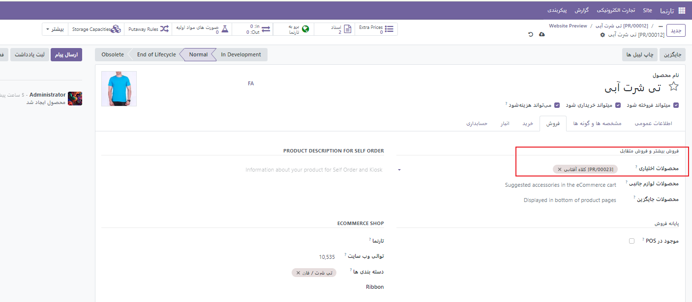
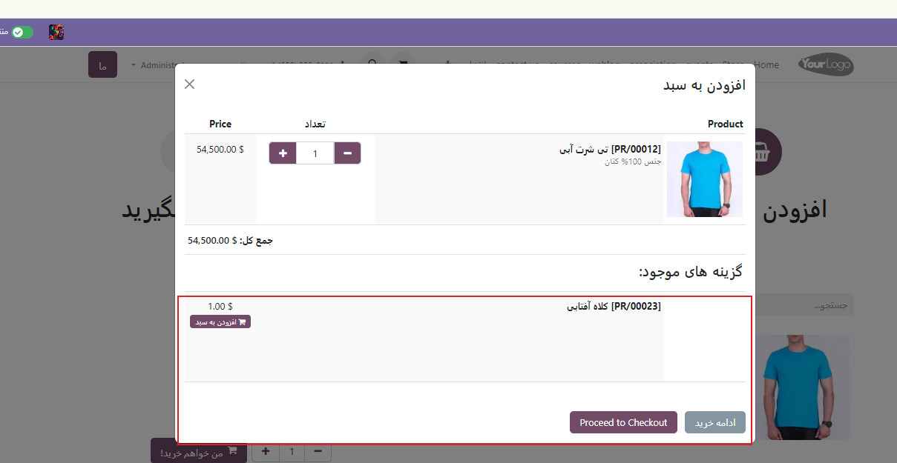
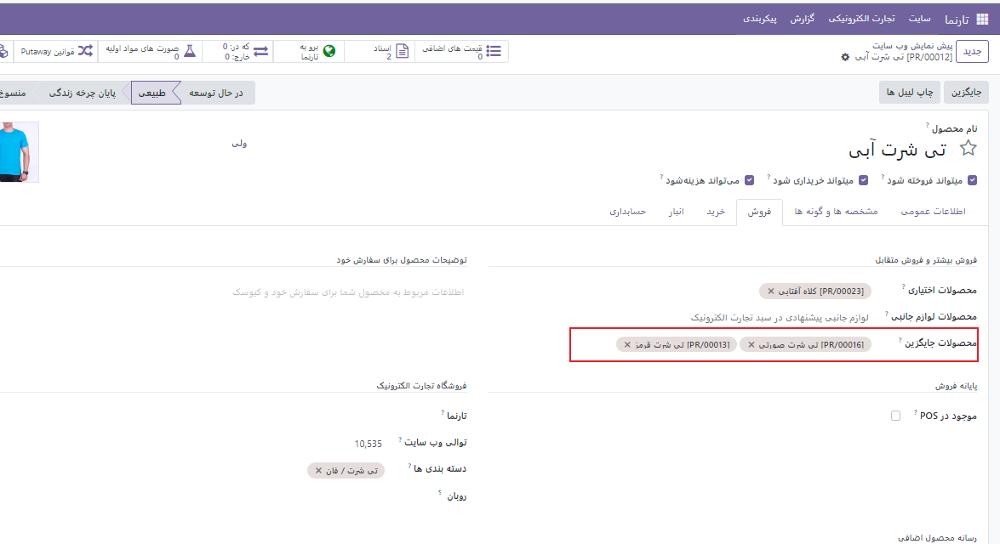
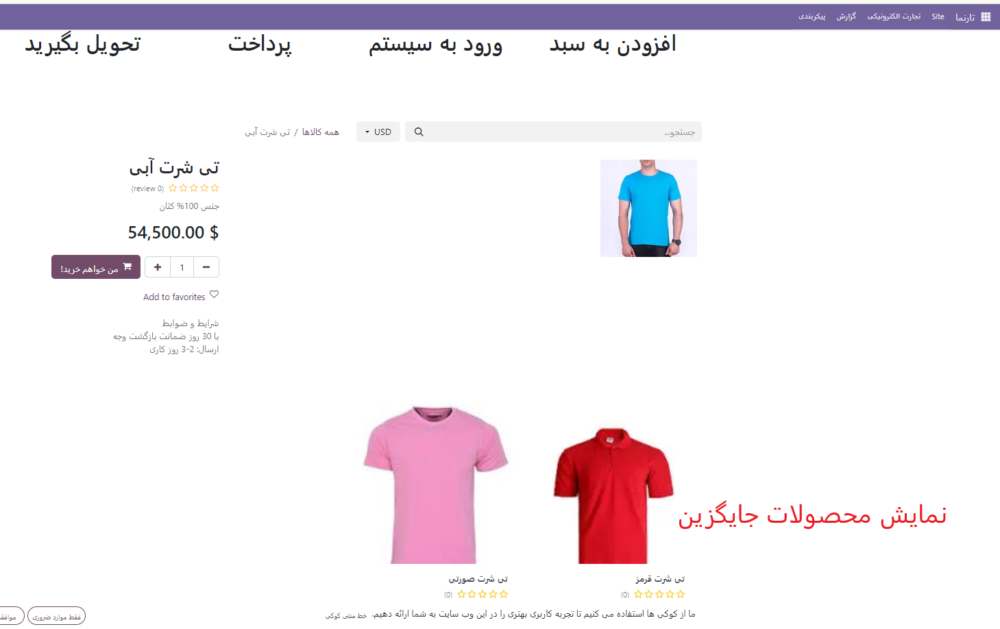
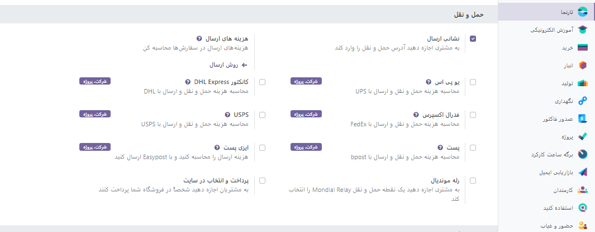
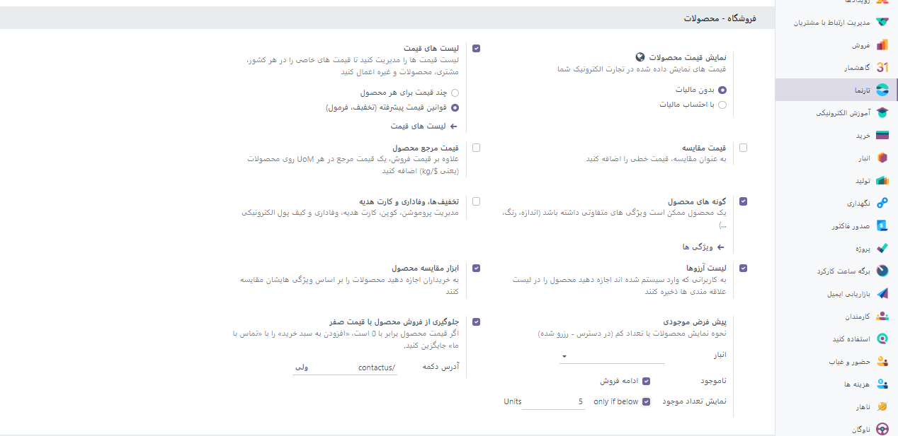
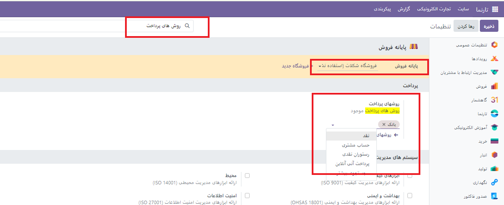

:nosearch:
:show-content:
:hide-page-toc:
:show-toc:

================
فروش متقابل=
===============

هر فرآیند فروش فرصتی برای به حداکثر رساندن درآمد است. فروش متقابل و افزایش فروش ، تکنیک‌های فروش هستند که شامل فروش محصولات و خدمات اضافی یا گران‌تر به مشتریان نسبت به آنچه در ابتدا برای آن خرید می‌کردند، می‌شوند. این یک راه عالی برای به حداکثر رساندن ارزش هر یک از مشتریان شما است.

فروش متقابل از طریق دو ویژگی قابل انجام است :

•	محصولات اختیاری پس از افزودن به سبد خرید

•	محصولات جانبی در صفحه پرداخت .

هنگامی که مشتریان از صفحه محصول یا صفحه کاتالوگ روی افزودن به سبد خرید کلیک می کنند، محصولات اختیاری پیشنهاد می شوند . پس از کلیک کردن، یک پنجره پاپ آپ باز می شود که محصولات اختیاری در قسمت گزینه های موجود نمایش داده می شوند .

پرفروش
-------------

محصولات جایگزین
^^^^^^^^^^^^^^^

محصولات جایگزین در صفحه محصول پیشنهاد می‌شوند و معمولاً مشتریان را تشویق می‌کنند تا نوع یا محصول گران‌تری نسبت به کالایی که در ابتدا خرید می‌کردند، بخرند.

سفارشی سازی عمل "افزودن به سبد خرید".
----------------------------------------

هنگامی که مشتریان بر روی دکمه افزودن به سبد خرید کلیک می کنند ، محصول به سبد خرید آنها اضافه می شود و مشتریان به طور پیش فرض در صفحه محصول باقی می مانند. با این حال، مشتریان می توانند فوراً به سبد خرید خود هدایت شوند یا از طریق یک کادر محاوره ای انتخاب کنند که چه کاری انجام دهند .

برای تغییر رفتار پیش‌فرض، به وب‌سایت ◄پیکربندی ◄تنظیمات بروید . در قسمت Shop - Checkout Process به دنبال افزودن به سبد خرید باشید و یکی از گزینه ها را انتخاب کنید.

دکمه "اکنون خرید".
^^^^^^^^^^^^^^^^^^^

می‌توانید دکمه «اکنون خرید» را فعال کنید تا به جای افزودن محصول به سبد خرید، مشتری را فوراً به تسویه‌حساب ببرید. دکمه خرید اکنون یک دکمه اضافی است و جایگزین دکمه افزودن به سبد خرید نمی شود . برای فعال کردن آن، به وب‌سایت ‣ پیکربندی ‣ تنظیمات ‣ فرآیند خرید - پرداخت بروید و اکنون خرید را علامت بزنید .

سفارش مجدد از پورتال
---------------------------------
مشتریان امکان سفارش مجدد اقلام از سفارشات فروش قبلی را در درگاه مشتریان دارند. برای انجام این کار، به وب‌سایت ‣ پیکربندی ‣ تنظیمات ‣ فرآیند خرید - پرداخت بروید و سفارش مجدد از پورتال را فعال کنید . مشتریان می توانند دکمه سفارش مجدد را در سفارش فروش خود از پورتال مشتری بیابند .

پرداخت
------------------
شما می توانید مراحل پرداخت را شخصی سازی کنید. برای این کار کافیست از بلاک  مرحله (step)  را به صفحه محصولات اضافه کنید.

روش های پرداخت حمل و نقل 
-----------------------
بسته به استراتژی حمل و نقل خود، این انتخاب را دارید که یا از روش های حمل و نقل خود استفاده کنید یا از یکپارچگی با یک ارائه دهنده حمل و نقل موجود استفاده کنید .

روش حمل و نقل خود
-------------------------

شما می توانید روش پرداخت حمل و نقل خود را با قانونین دلخواه خود تعریف کنید.

وب سایت◄پیکربندی◄حمل و نقل◄   تیک گزینه **نشانی ارسال** را می زنیم.

بعد از فعال کردن این گزینه می توانید، شما می توانید از سه گزینه **قیمت ثابت** ، **بر اساس قوانین** و یا **پرداخت در محل** استفاده کنید

مطابق عکس زیر می توانید سایر تنظیمات حمل و نقل را انجام دهید.

همچنین می توانید گزینه **تحویل در فروشگاه ** را فعال کنید. و سایز تتنظیمات مربوط به فروشگاه را به صورت دلخواه مطابق عکس تغییر دهید.

روش های پرداخت
------------------------
شما می توانید در تنظیمات برای وب سایت یا فروشگاه منتخب یک روش پرداخت دلخواه که از قبل تعیین شده باشد را انتخاب کنید.

مدیریت فروش الکترونیکی
-------------------------

رسیدگی به سفارش
^^^^^^^^^^^^^^^^^^
زمانیکه مشتری یک سفارش را ثبت میکند سه نوع رکود به وجور می آید.

•	سفارش فروش

•	سفارش تحویل

•	الزامات و قوانین و فاکتورها
