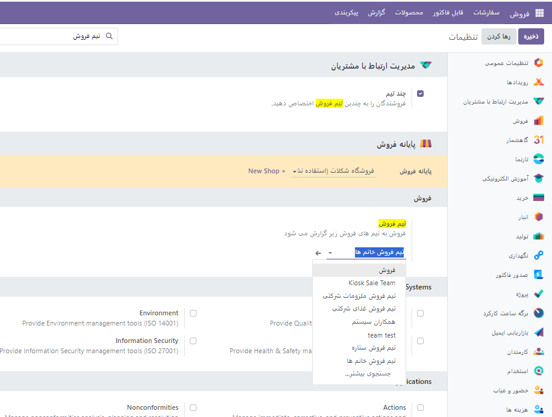
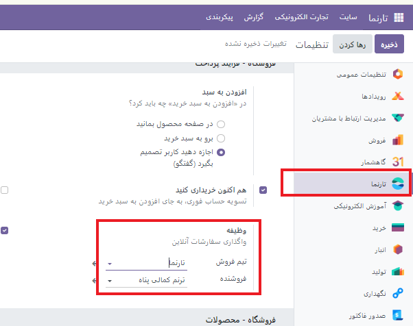
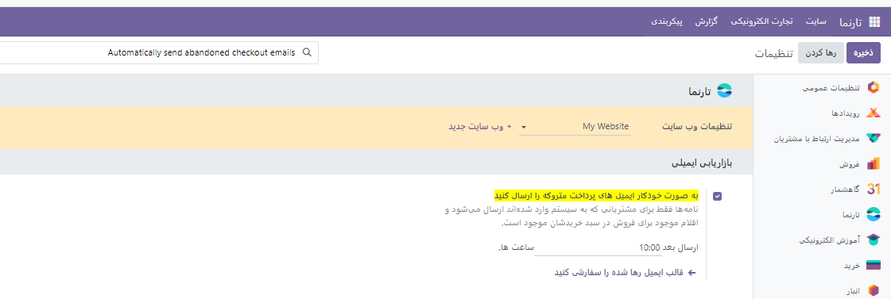
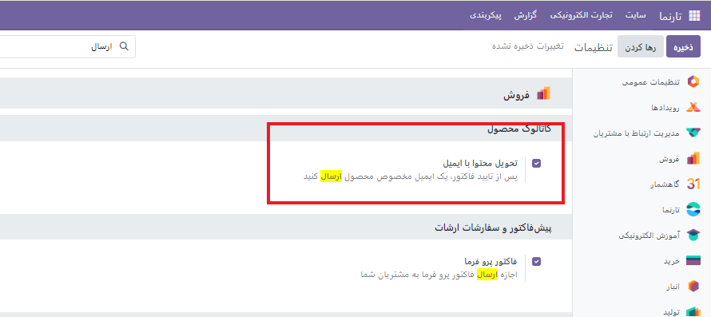
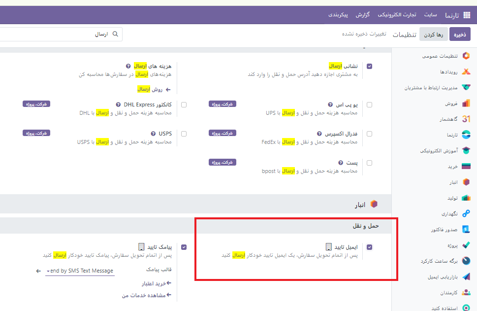

:nosearch:
:show-content:
:hide-page-toc:
:show-toc:

================
فروش متقابل=
===============

هر فرآیند فروش فرصتی برای به حداکثر رساندن درآمد است. فروش متقابل و افزایش فروش ، تکنیک‌های فروش هستند که شامل فروش محصولات و خدمات اضافی یا گران‌تر به مشتریان نسبت به آنچه در ابتدا برای آن خرید می‌کردند، می‌شوند. این یک راه عالی برای به حداکثر رساندن ارزش هر یک از مشتریان شما است.

فروش متقابل از طریق دو ویژگی قابل انجام است :

•	محصولات اختیاری پس از افزودن به سبد خرید

•	محصولات جانبی در صفحه پرداخت .

هنگامی که مشتریان از صفحه محصول یا صفحه کاتالوگ روی افزودن به سبد خرید کلیک می کنند، محصولات اختیاری پیشنهاد می شوند . پس از کلیک کردن، یک پنجره پاپ آپ باز می شود که محصولات اختیاری در قسمت گزینه های موجود نمایش داده می شوند .

.. image:: ./img/ec24.png
    :alt:  آموزش تجارت الکترونیک
    :align: center

.. image:: ./img/ec25.png
    :alt:  آموزش تجارت الکترونیک
    :align: center

پرفروش
-------------

محصولات جایگزین
--------------------

محصولات جایگزین در صفحه محصول پیشنهاد می‌شوند و معمولاً مشتریان را تشویق می‌کنند تا نوع یا محصول گران‌تری نسبت به کالایی که در ابتدا خرید می‌کردند، بخرند.

.. image:: ./img/ec26.png
    :alt:  آموزش تجارت الکترونیک
    :align: center

سفارشی سازی عمل "افزودن به سبد خرید".
----------------------------------------

هنگامی که مشتریان بر روی دکمه افزودن به سبد خرید کلیک می کنند ، محصول به سبد خرید آنها اضافه می شود و مشتریان به طور پیش فرض در صفحه محصول باقی می مانند. با این حال، مشتریان می توانند فوراً به سبد خرید خود هدایت شوند یا از طریق یک کادر محاوره ای انتخاب کنند که چه کاری انجام دهند .

برای تغییر رفتار پیش‌فرض، به وب‌سایت ◄پیکربندی ◄تنظیمات بروید . در قسمت Shop - Checkout Process به دنبال افزودن به سبد خرید باشید و یکی از گزینه ها را انتخاب کنید.

دکمه "اکنون خرید".
---------------------^^^^^^^^

می‌توانید دکمه «اکنون خرید» را فعال کنید تا به جای افزودن محصول به سبد خرید، مشتری را فوراً به تسویه‌حساب ببرید. دکمه خرید اکنون یک دکمه اضافی است و جایگزین دکمه افزودن به سبد خرید نمی شود . برای فعال کردن آن، به وب‌سایت ‣ پیکربندی ‣ تنظیمات ‣ فرآیند خرید - پرداخت بروید و اکنون خرید را علامت بزنید .

سفارش مجدد از پورتال
---------------------------------
مشتریان امکان سفارش مجدد اقلام از سفارشات فروش قبلی را در درگاه مشتریان دارند. برای انجام این کار، به وب‌سایت ‣ پیکربندی ‣ تنظیمات ‣ فرآیند خرید - پرداخت بروید و سفارش مجدد از پورتال را فعال کنید . مشتریان می توانند دکمه سفارش مجدد را در سفارش فروش خود از پورتال مشتری بیابند .

پرداخت
------------------
شما می توانید مراحل پرداخت را شخصی سازی کنید. برای این کار کافیست از بلاک  مرحله (step)  را به صفحه محصولات اضافه کنید.

روش های پرداخت حمل و نقل 
-----------------------
بسته به استراتژی حمل و نقل خود، این انتخاب را دارید که یا از روش های حمل و نقل خود استفاده کنید یا از یکپارچگی با یک ارائه دهنده حمل و نقل موجود استفاده کنید .

روش حمل و نقل خود
-------------------------

شما می توانید روش پرداخت حمل و نقل خود را با قانونین دلخواه خود تعریف کنید.

وب سایت◄پیکربندی◄حمل و نقل◄   تیک گزینه **نشانی ارسال** را می زنیم.

بعد از فعال کردن این گزینه می توانید، شما می توانید از سه گزینه **قیمت ثابت** ، **بر اساس قوانین** و یا **پرداخت در محل** استفاده کنید

مطابق عکس زیر می توانید سایر تنظیمات حمل و نقل را انجام دهید.

.. image:: ./img/ec28.png
    :alt:  آموزش تجارت الکترونیک
    :align: center

همچنین می توانید گزینه **تحویل در فروشگاه ** را فعال کنید. و سایز تتنظیمات مربوط به فروشگاه را به صورت دلخواه مطابق عکس تغییر دهید.

روش های پرداخت
------------------------
شما می توانید در تنظیمات برای وب سایت یا فروشگاه منتخب یک روش پرداخت دلخواه که از قبل تعیین شده باشد را انتخاب کنید.

.. image:: ./img/ec30.png
    :alt:  آموزش تجارت الکترونیک
    :align: center

مدیریت فروش الکترونیکی
-------------------------

رسیدگی به سفارش
---------------------^^^^^^^
زمانیکه مشتری یک سفارش را ثبت میکند سه نوع رکود به وجور می آید.

•	سفارش فروش

•	سفارش تحویل

•	الزامات و قوانین و فاکتورها

سفارش های فروش
--------------------------

زمانیکه مشتری محصولی را به سبد خود اضافه میکند اولین قدم قیمت ایجاد یک قیمت است. سفارشات را می توان از طریق وب سایت یا برنامه فروش مدیریت کرد .
وب سایت ◄ پیکربندی ◄ تنظیمات   به طور خودکار به یک تیم فروش اختصاص دهید.

هر سفارش فروش می تواند در سه وضعیت قرار بگیرد.

•	نقل قول : یک محصول جدید به سبد خرید اضافه می شود، اما مشتری هنوز مراحل پرداخت را طی نکرده است.

•	پیشنهاد ارسال شده : مشتری مراحل پرداخت را طی کرده و سفارش را تایید کرده است، اما پرداخت هنوز تایید نشده است.

•	سفارش : مشتری مراحل پرداخت را طی کرده، سفارش را تایید کرده و وجه پرداختی دریافت می‌شود.

سبد خرید رها شده
--------------------------
در این سبد خرید مشتری سفارش های خود را ناتمام و بدون پرداخت رها کرده است. برای پیگیری این سبد ایمیل خودکاری جهت  یادآوری تکمیل فرآیند خرید برای او ارسال می شود.

ایمیل ارسال
^^^^^^^^^

پس از تایید فاکتور و یا حتی تایید سفارشات می توانیم با فعال کردن گزینه های زیر یک ایمل هنگام تحویل سفارش و یا تایید فاکتور ارسال شود.

حساب چند وب سایتی
------------------------------

اگر صاحب چندین وب سایت هستید، می توانید حساب های مشتری را در همه وب سایت ها در دسترس قرار دهید. سپس، مشتری فقط به یک حساب کاربری نیاز دارد. برای انجام این کار، به وب‌سایت ◄ پیکربندی ◄ تنظیمات ◄بخش حریم خصوصی بروید و اشتراک‌های مشترک مشتری را فعال کنید .

تعامل با مشتری
--------------------
Odoo  راه حل های زیادی را برای ارتباط  وتعامل با مشتری ارائه می دهد.

بررسی محصول
-------------------

مشتریان می توانند به محصولات شما امتیاز بدهند. این یک راه عالی برای تبلیغ محصولات یا خدمات شما است زیرا بررسی ها می توانند بر فرآیند خرید تأثیر بگذارند. برای فعال کردن ویژگی رتبه‌بندی ، از صفحه فروشگاه خود ، یک محصول را انتخاب کنید، به ویرایش ◄ سفارشی کردن و فعال کردن رتبه‌بندی بروید .

توجه داشته باشید
فقط کاربران پورتالی که محصول یا خدمات را خریداری کرده اند می توانند امتیاز دهند.

چت زنده
--------------
یک ربات چت در دسترس است و می تواند مکالمه ای شبیه به انسان را با بازدیدکنندگان وب سایت از طریق پیام های متنی در جعبه چت شبیه سازی کند.
فرم های تماس
----------

مشتریان ممکن است پس از خرید یک محصول یا اشتراک در یک سرویس به پشتیبانی نیاز داشته باشند. امکان ایجاد یک فرم تماس وجود دارد که پس از تکمیل، به طور خودکار یک بلیط جدید برای تیم پشتیبانی شما ایجاد می کند .

برای افزودن فرم تماس، در صورت لزوم یک صفحه جدید ایجاد کنید ( + صفحه ‣ جدید ) و یک بلوک فرم را از قسمت محتوای پویا به صفحه بکشید و رها کنید. پس از قرار دادن، روی فرم کلیک کنید (در حالت ویرایش ) و در قسمت Action ، Create a Ticket را انتخاب کنید . سپس می توانید انتخاب کنید که بلیط به کدام تیم Helpdesk اختصاص داده شود.

با ما تماس بگیرید 
---------------------

صفحه "تماس با ما" این امکان را برای مشتریان و مشتریان احتمالی فراهم می کند که با شرکت شما تماس بگیرند و با ما تماس بگیرند.

برای داشتن صفحه «تماس با ما»، در صورت لزوم یک صفحه جدید ( +جدید ◄ صفحه ) ایجاد کنید و روی ویرایش ◄ سفارشی کردن کلیک کنید . سپس یک بلوک فرم را بکشید و روی صفحه رها کنید. فرم را انتخاب کنید و در قسمت Action اقدامی را که باید هنگام ارسال انجام شود، تعریف کنید .

هنگام کلیک بر روی یک فیلد یا هنگام افزودن یک فیلد جدید ( + فیلد )، می توانید نوع آن را انتخاب کنید . این گزینه‌های مختلفی را فعال می‌کند، مانند چک باکس‌های متعدد ، که مشتریان می‌توانند از آن برای نشان دادن خدماتی که به آن‌ها علاقه دارند استفاده کنند.

خبرنامه
---------------------

مشتریان می توانند با عضویت در یک خبرنامه، به روز رسانی فعالیت های تجارت الکترونیک شما را دریافت کنند. بازدیدکنندگانی که در خبرنامه مشترک می شوند به طور خودکار به لیست پستی برنامه بازاریابی ایمیلی اضافه می شوند . شما می توانید یک بلوک خبرنامه، یک پنجره بازشو خبرنامه یا هر دو را انتخاب کنید.

لینک ها:

1. https://oxydoo.com/blog/guide-28/electronic-commerce-264
2. https://www.odoo.com/documentation/17.0/applications/websites/ecommerce.html

تگ ها:

	:guilabel:`#تجارت_الکترونیک` :guilabel:`#فروش` :guilabel:`#خرید` :guilabel:`#فروش_آنلاین` :guilabel:`#پرداخت_آنلاین` :guilabel:`#فروش_آنلاین` :guilabel:`#فروشگاه_آنلاین` :guilabel:`#OnlineBusiness` :guilabel:`#DigitalCommerce` :guilabel:`#eMarketing` :guilabel:`#ePayment`

