:nosearch:
:show-content:
:hide-page-toc:
:show-toc:

====================
مشاغل آنلاین
====================

برای تعریف شغل ها در سایت و اعلام درخواست موقعیت شغلی به صورت آنلاین. پس از نصب ماژول سایت مطابق عکس زیر عمل کنید.

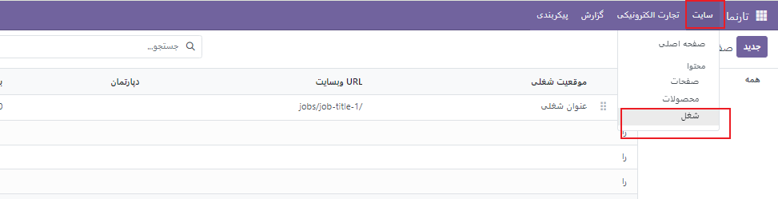

پس از انتخاب گزینه **جدید** مطابق شکل زیر صفحه ایی باز شده که آن موقعیت شغلی مد نظر را می توانید اضافه کنید. همینطور از ساید بار سمت چپ صفحه می توانید صفحه ی استخدام را با المان های مورد نظر خود کم یا زیاد کرده و به صورت سفارشی درست کنید.ابتدا با صفحه زیر روبه رو خواهید شد. با اضافه کردن موقعیت شغلی مورد نظر خود و به حالت انتشار در آوردن آن ، آن موقعیت شغلی را می توانید در سایت خود مشاهده کنید.

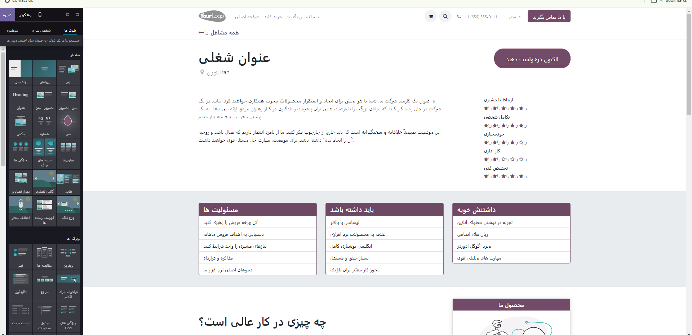

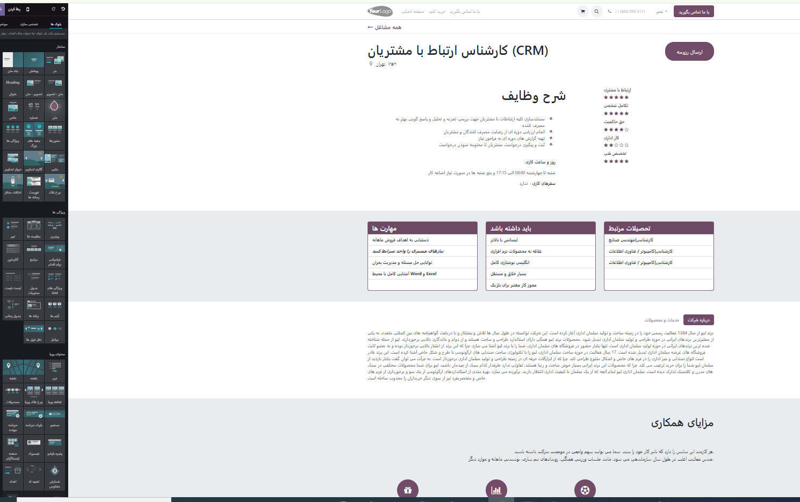

.. example::
    مثال: برای دیدن تمام فرصت های شغلی چه کنیم؟
    ابتدا یک فرصت شغلی دیگر ایجاد کرده و مطابق عکس عمل میکنیم.
    .. image:: ./img/webhr4.png
        :alt:  آموزش مشاغل آنلاین 
        :align: center

 سپس وارد صفحه زیر می شوید. در این صفحه می توانید تمام مشاغل درج شده را ببینید. به لینک آدرس صفحه دقت فرمایید.

    .. image:: ./img/webhr5.png
        :alt:  آموزش مشاغل آنلاین 
        :align: center

برای اینکه بتوانیم تام مشاغل را سایت ببینیم باید در صفحه اصلی یک منو با نا دلخواه ایجاد کنیم و این صفحه ی شغل ها را به ان لینک دهیم.

وارد منوی سایت می شویم، گزینه **ویرایشگر منو**

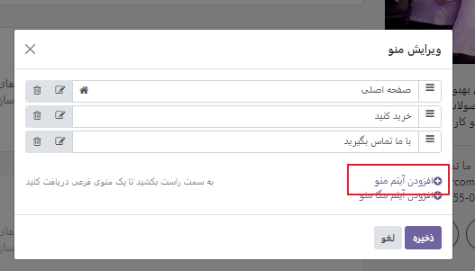

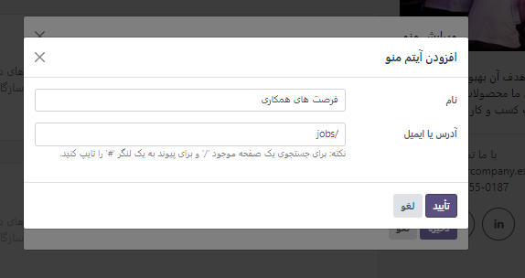

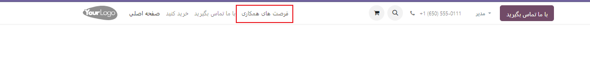

توجه داشته باشید شما از منو **شغل** می توانید تمام مشاغل ایجاد شده را ببینید و با آدرس لینک به صفحه ی منو مورد نظر لینک نمایید.

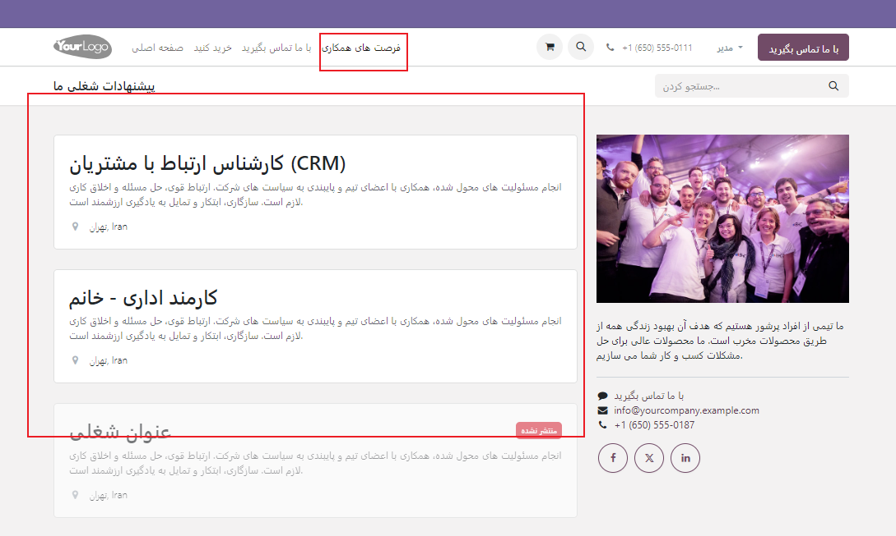

زمانیکه یک متقاضی برای موقعیت های فعال شما از روی سایت درخواست دهد به مراتب مانند عکس های زیر مراحل انجام می شود.

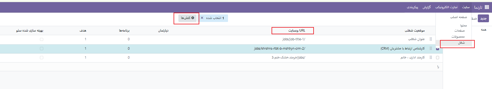

بعد از ارسال تقاضا مانند عکس زیر میتوانید عمل کنید تا اطلاعات درخواست دهنده را دریافت کنید.

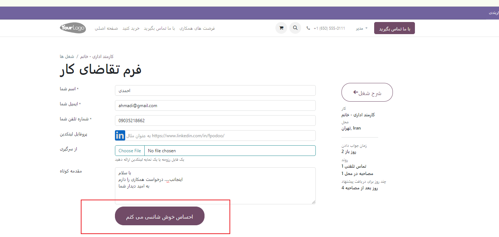

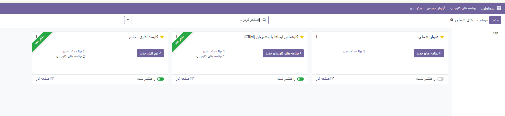

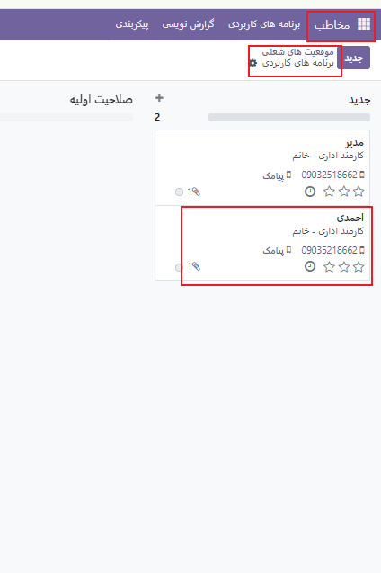

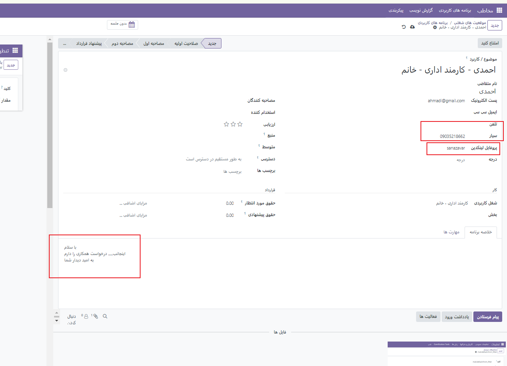
.. toctree::
   :titlesonly:

   ./howtouse
