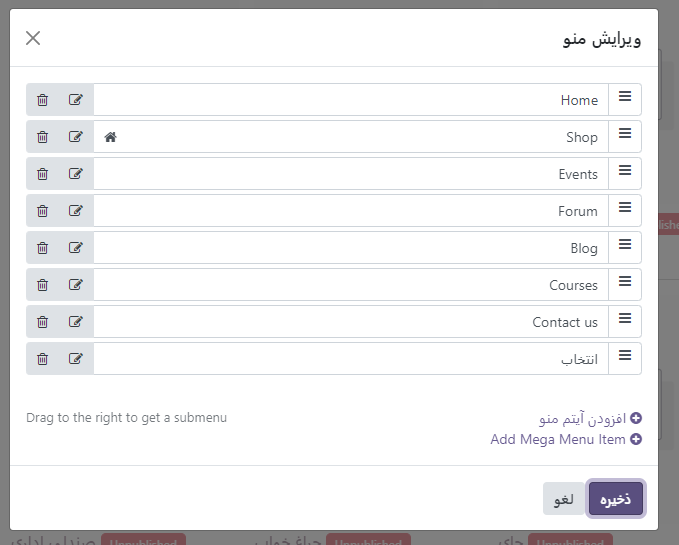
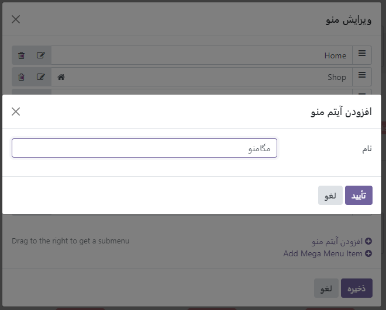
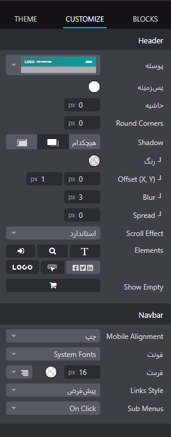

:nosearch:
:show-content:
:hide-page-toc:
:show-toc:

====================
منو
====================

استفاده از منوها برای سازماندهی محتوای وب سایت شما اهمیت بسیاری دارد، زیرا به بازدیدکنندگان کمک می‌کند تا به طور مؤثر در صفحات وب شما حرکت کنند و به راحتی به اطلاعات مورد نیاز خود دسترسی پیدا کنند. منوهای وب سایت کاربرپسند و دارای ساختار مناسب نیز نقش مهمی در بهبود رتبه‌بندی موتورهای جستجو دارند.

Odoo به شما امکان می‌دهد محتوا و ظاهر منوی وب سایت خود را مطابق با نیازهای خود سفارشی کنید. با استفاده از ابزارهای قدرتمند Odoo، شما می‌توانید منوهای وب سایت خود را به آسانی و بدون نیاز به دانش فنی عمیق، تغییر دهید و سفارشی‌سازی کنید. این امکان به شما اجازه می‌دهد تا تجربه کاربری بهتری را برای بازدیدکنندگانتان ارائه دهید و در نتیجه، بهبود قابل ملاحظه‌ای در رتبه‌بندی وب سایت خود در موتورهای جستجو داشته باشید.

ویرایشگر منو
--------------

ویرایشگر منو به شما امکان می‌دهد منوی وب سایت خود را ویرایش کنید و آیتم‌های منوی معمولی و مگا منوها را اضافه کنید.

برای ویرایش منوی وب سایت خود، به "وب سایت" -> "سایت" -> "ویرایشگر منو" بروید. از آنجا می‌توانید:

- یک آیتم منو را تغییر نام دهید یا URL آن را با استفاده از نماد "ویرایش آیتم منو" تغییر دهید.
- با استفاده از نماد "حذف آیتم منو" یک آیتم منو را حذف کنید.
- یک آیتم منو را با کشیدن و رها کردن آن به مکان مورد نظر در منو، جابه‌جا کنید.
- با کشیدن و رها کردن آیتم‌های زیر منو به سمت راست، در زیر منوی اصلی، یک منوی کشویی معمولی ایجاد کنید.

.. Note::
    همچنین می‌توانید با کلیک کردن بر روی هر مورد از منو، سپس انتخاب آیتم مورد نظر و کلیک کردن بر روی نماد "ویرایش آیتم منو"، به ویرایشگر منو دسترسی پیدا کنید. این کار به شما امکان می‌دهد تا به راحتی و با سرعت آیتم‌های منوی خود را ویرایش کنید و تنظیمات مربوط به آن‌ها را تغییر دهید.

    .. image:: ./img/website31.png
     :alt: وبسایت
     :align: center

افزودن آیتم های منوی معمولی
-----------------

به‌طور پیش‌فرض، صفحات هنگام ایجاد به عنوان آیتم‌های منوی معمولی به منو اضافه می‌شوند. همچنین می‌توانید با کلیک روی "افزودن آیتم منو"، آیتم‌های منوی معمولی را از ویرایشگر منو اضافه کنید. برای این کار، نام و URL صفحه مربوطه را در پنجره پاپ آپی که روی صفحه ظاهر می‌شود، وارد کرده و سپس بر روی "OK" کلیک کنید. این کار به شما امکان می‌دهد به راحتی صفحات مورد نظر خود را به منوی وب سایت اضافه کنید و آن‌ها را با نام مناسب و URL مربوطه مشخص کنید.

.. Note::
    در قسمت URL یا ایمیل، می‌توانید "/" برای جستجوی صفحه‌ای در وب‌سایت خود یا "#" برای جستجوی یک لنگر سفارشی موجود را تایپ کنید. استفاده از این قابلیت‌ها به شما امکان می‌دهد تا به سرعت به صفحات یا بخش‌های مورد نظر در وب‌سایت خود دسترسی پیدا کنید و یا به لنگرهای خاص در صفحات مراجعه کنید.

افزودن مگا منوها
-------------------

مگا منوها شبیه به منوهای کشویی هستند، اما به جای یک لیست ساده از منوهای فرعی، یک پانل تقسیم شده به گروه‌های گزینه‌های ناوبری را نمایش می‌دهند. این باعث می‌شود آنها برای وب‌سایت‌هایی با حجم زیاد محتوا مناسب باشند، زیرا می‌توانند به گنجاندن تمام صفحات وب شما در منو کمک کنند و در عین حال همه موارد منو را به یکباره نمایان کنند. مگا منوها همچنین می‌توانند ساختار بصری بیشتری نسبت به منوهای کشویی معمولی داشته باشند، به عنوان مثال، از طریق طرح بندی، تایپوگرافی و نمادها. این ویژگی‌ها باعث می‌شود مگا منوها به عنوان یک راه حرفه‌ای و جذاب برای نمایش منوهای ناوبری در وب‌سایت‌ها مورد استفاده قرار گیرند، به‌خصوص برای وب‌سایت‌هایی که حجم زیادی از محتوا دارند.

برای ایجاد یک مگا منو، به وب سایت ‣ سایت ‣ ویرایشگر منو بروید و روی "Add Mega Menu Item" کلیک کنید. سپس نام مگا منو را در پنجره بازشو وارد کنید و روی "OK" و سپس "Save" کلیک کنید.

برای تطبیق گزینه‌ها و طرح‌بندی مگا منو، روی آن در نوار پیمایش کلیک کنید، سپس روی "ویرایش" کلیک کنید. مگا منوها از بلوک‌های ساختمانی تشکیل شده‌اند، به این معنی که می‌توانید هر مؤلفه را به صورت جداگانه با استفاده از قالب‌بندی درون خطی و همچنین گزینه‌های موجود در برگه سفارشی‌سازی در سازنده وب‌سایت سفارشی کنید. به عنوان مثال، شما می توانید:

- متن را مستقیماً در بلوک ساختمان ویرایش کنید.
- URL آیتم منو را با انتخاب آیتم منو ویرایش کنید، سپس روی دکمه "ویرایش پیوند" در پاپ آپ کوچک پیش نمایش کلیک کنید. برای جستجوی یک صفحه در وب سایت خود یا "#" برای جستجوی یک لنگر سفارشی موجود، تایپ کنید.
-	با کشیدن و رها کردن بلوک مربوطه به موقعیت دلخواه در مگا منو، می‌توانید یک آیتم منو را حرکت دهید. این کار به شما امکان می‌دهد تا آیتم‌های منو را به ترتیب دلخواه خود در مگا منو مرتب کنید و یا آن‌ها را به موقعیت‌های دیگر انتقال دهید.
-	همچنین با حذف بلوک مربوطه، می‌توانید یک آیتم منو را حذف کنید. این کار به شما امکان می‌دهد تا آیتم‌های منوی غیرضروری را از مگا منو حذف کرده و منو را به شکلی که مطابق با نیاز وب‌سایت شماست، سفارشی‌سازی کنید.

.. Note:: 
    می‌توانید با انتخاب قالب و اندازه مورد نظر در قسمت "Mega menu" در تب "Customize" در سازنده وب‌سایت، طرح کلی مگا منو را تطبیق دهید. این امکان به شما اجازه می‌دهد تا ظاهر و ساختار مگا منو را به دلخواه خود سفارشی کنید و آن را با سایر بخش‌های وب‌سایت خود هماهنگ کنید. با انتخاب قالب مناسب و تنظیم اندازه و ترتیب مناسب، می‌توانید تجربه کاربری بهتری را برای بازدیدکنندگان وب‌سایت خود فراهم کنید.

ظاهر هدر و نوار ناوبری
--------------------

برای سفارشی کردن ظاهر منوی وب‌سایت خود، ابتدا روی "ویرایش" کلیک کنید، سپس نوار پیمایش یا هر مورد از منو را انتخاب کنید. سپس می‌توانید فیلدهای بخش "Header" و "Navbar" را در تب "Customize" در سازنده وب‌سایت تطبیق دهید. این امکان به شما اجازه می‌دهد تا رنگ‌ها، قلم‌ها، پس‌زمینه‌ها و دیگر ویژگی‌های ظاهری منو را به دلخواه خود تغییر دهید تا با سبک و طراحی کلی وب‌سایتتان هماهنگ شود.

