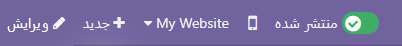
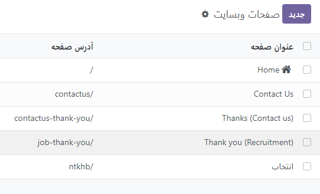

:nosearch:
:show-content:
:hide-page-toc:
:show-toc:

====================
صفحات
====================

با Odoo می‌توانید صفحات سفارشی برای وب‌سایت خود ایجاد کنید و محتوا و ظاهر آن‌ها را به دلخواه خود تنظیم کنید.

.. Note::
   صفحات استاتیک دارای محتوای پایداری هستند و مانند صفحه اصلی عمل می‌کنند. شما می‌توانید به صورت دستی صفحات جدید ایجاد کنید، URL آن‌ها را تعریف کنید و ویژگی‌های آن‌ها را تنظیم کنید. از طرف دیگر، صفحات پویا به صورت دینامیک تولید می‌شوند. این صفحات بطور خودکار توسط Odoo تولید می‌شوند، به عنوان مثال زمانی که یک برنامه یا ماژول را نصب می‌کنید (مانند /shop یا /blog) یا یک محصول یا پست وبلاگ جدید منتشر می‌کنید. به همین دلیل، صفحات پویا به شیوه‌های مدیریت متفاوتی نیاز دارند.

ایجاد صفحه
---------------

برای ایجاد یک صفحه جدید وب‌سایت، می‌توانید به صورت زیر عمل کنید:

1. از طریق برنامه Website:
   - برنامه Website را باز کنید.
   - در گوشه سمت راست بالای صفحه روی "+ New" کلیک کنید و سپس "Page" را انتخاب کنید.

2. یا از طریق منوهای Website:
   - به Website ‣ Site ‣ Pages بروید.
   - روی دکمه "New" کلیک کنید.

3. در قسمت مربوطه، عنوان صفحه خود را وارد کنید؛ این عنوان هم در منوی وب‌سایت و هم در URL صفحه استفاده می‌شود.
4. پس از وارد کردن عنوان، روی دکمه "Create" یا "ایجاد" کلیک کنید.
5. سپس، محتوا و ظاهر صفحه را با استفاده از ابزار سازنده وب‌سایت سفارشی کنید. وقتی کار خود را تکمیل کردید، روی دکمه "Save" یا "ذخیره" کلیک کنید.
6. در نهایت، صفحه خود را منتشر کنید تا به دسترس عموم قرار گیرد.

.. Note::
   اگر می‌خواهید صفحه در منوی وب‌سایت نمایش داده نشود، می‌توانید گزینه "افزودن به منو" را غیرفعال کنید. 

مدیریت صفحه
---------------

--------------
انتشار/لغو انتشار صفحات
--------------

صفحات باید در دسترس باشند تا کاربران وب سایت به آنها دسترسی داشته باشند. برای انتشار یا لغو انتشار یک صفحه، ابتدا باید به آن دسترسی داشته باشید. سپس، در گوشه سمت راست بالای صفحه، سوئیچ موجود را از وضعیت "Unpublished" به "Published" یا برعکس تغییر دهید. این عملیات به شما اجازه می‌دهد که صفحه را برای بازدیدکنندگان به حالت منتشر شده درآورید یا از حالت منتشر شده خارج کنید.

.. Note::
   با تشکر از اطلاعات ارائه شده. برای انتشار یا لغو انتشار یک صفحه، می‌توانید از ویژگی‌های صفحه استفاده کنید که به شما امکان تعیین تاریخ انتشار و محدود کردن دسترسی به صفحه را می‌دهد. همچنین، اگر نیاز به انتشار یا لغو انتشار چندین صفحه به طور همزمان دارید، می‌توانید به بخش "وب سایت" -> "سایت" -> "صفحات" بروید، صفحات مورد نظر خود را انتخاب کنید، سپس روی "Action" کلیک کرده و گزینه انتشار یا لغو انتشار را انتخاب کنید. این امکان به شما اجازه می‌دهد تا به راحتی و به صورت دسته‌ای صفحات را منتشر یا لغو انتشار کنید.

صفحه نخست
-----------

صفحه اصلی وب سایت به عنوان نقطه شروع ارتباط با بازدیدکنندگان بسیار مهم است. در Odoo، شما می‌توانید صفحه اصلی خود را انتخاب کنید یا تعریف کنید.

برای تعیین یک صفحه به عنوان صفحه اصلی، می‌توانید به مسیر "وب سایت" -> "پیکربندی" -> "تنظیمات" بروید و در بخش "اطلاعات وب سایت"، آدرس مورد نظر را در فیلد "URL صفحه اصلی" تعیین کنید. به عنوان مثال، می‌توانید "/shop" را وارد کنید.

همچنین، می‌توانید به مسیر "وب سایت" -> "سایت" -> "ویژگی ها" بروید، برگه مورد نظر را انتخاب کرده و "Use as Homepage" را فعال کنید. این عمل به شما اجازه می‌دهد تا هر صفحه ای را به عنوان صفحه اصلی انتخاب کنید.

ویژگی های صفحه
-----------------

برای تغییر خصوصیات یک صفحه، می‌توانید به آن صفحه دسترسی پیدا کنید، سپس به "Site" -> "Properties" بروید و تغییرات مورد نظر را اعمال کنید.

تب Name به شما امکان می‌دهد:
--------------------------

1.	با استفاده از قسمت Page Name، می‌توانید نام صفحه را تغییر دهید.
2.	می‌توانید آدرس (URL) صفحه را نیز تغییر دهید. در این صورت، اگر نیاز داشتید می‌توانید URL قدیمی را به آدرس جدید هدایت کنید. برای انجام این کار، می‌توانید Redirect URL قدیمی را فعال کنید، سپس نوع تغییر مسیر را انتخاب کنید:
- برای تغییر مسیر دائمی صفحه، می‌توانید 301 Redirect را انتخاب کنید که به این معنی است که صفحه به طور دائمی به آدرس جدید هدایت خواهد شد.
- برای تغییر مسیر موقت صفحه، می‌توانید 302 Redirect را انتخاب کنید که به این معنی است که صفحه به طور موقت به آدرس جدید هدایت خواهد شد.
این امکانات به شما اجازه می‌دهند تا به راحتی نام و آدرس صفحات خود را تغییر داده و در صورت نیاز از ریدایرکت‌های دائمی یا موقت استفاده کنید.

می‌توانید ویژگی‌های صفحه را در برگه انتشار بیشتر تطبیق دهید:
- **نمایش در منوی بالا:** اگر نمی‌خواهید صفحه در منوی بالا ظاهر شود، می‌توانید این گزینه را غیرفعال کنید.
- **استفاده به عنوان صفحه اصلی:** اگر می‌خواهید صفحه به عنوان صفحه اصلی وب سایت شما باشد، این گزینه را فعال کنید.
- **Indexed:** اگر نمی‌خواهید صفحه در نتایج موتورهای جستجو نمایش داده شود، می‌توانید این گزینه را غیرفعال کنید.
- **Published:** با فعال کردن این گزینه، صفحه انتشار می‌یابد.
- **تاریخ انتشار:** برای انتشار صفحه در یک زمان خاص، تاریخ مورد نظر را انتخاب کنید. برای تنظیم زمان، روی نماد ساعت کلیک کرده و سپس بر روی علامت سبز رنگ کلیک کنید تا انتخاب خود تأیید شود.
- **قابلیت مشاهده:** مشخص کنید که چه کسانی به صفحه دسترسی داشته باشند:
  - همه
  - فقط وارد شده‌ها
  - گروه محدود: گروه‌های دسترسی کاربر را در قسمت "گروه مجاز" انتخاب کنید.
  - با رمز عبور: رمز عبور را در قسمت "رمز عبور" وارد کنید.

.. Note::
   برخی از این ویژگی ها را می توان از  "وب سایت" -> "سایت" -> "صفحات" نیز تغییر داد .

صفحات تکراری
--------------------

برای کپی کردن یک صفحه، به صفحه مورد نظر دسترسی پیدا کرده، سپس به "Site" -> "Properties" بروید و روی "Duplicate Page" کلیک کنید. سپس یک نام برای صفحه جدید وارد کنید و روی "OK" کلیک کنید. به طور پیش‌فرض، صفحه جدید پس از صفحه اصلی در منو اضافه می‌شود، اما می‌توانید با استفاده از ویرایشگر منو، آن را از منو حذف کنید یا موقعیت آن را تغییر دهید.

حذف صفحات
-----------------
برای حذف یک صفحه، به صفحه مورد نظر دسترسی پیدا کنید، سپس به "Site" -> "Properties" بروید و روی "حذف صفحه" کلیک کنید. یک پنجره پاپ‌آپ ظاهر می‌شود که همه پیوندهای مربوط به صفحه را که می‌خواهید حذف کنید، سازماندهی شده بر اساس دسته‌بندی نشان می‌دهد. برای اطمینان از اینکه بازدیدکنندگان وب سایت در صفحه خطای 404 قرار نمی‌گیرند، باید تمام پیوندهای وب سایت خود را که به صفحه ارجاع می‌دهند را به‌روز کنید. برای انجام این کار، یک دسته را گسترش دهید، سپس روی یک پیوند کلیک کنید تا آن را در یک پنجره جدید باز کنید. همچنین، می‌توانید یک تغییر مسیر برای صفحه حذف شده تنظیم کنید. سپس هنگامی که پیوندها را به‌روز کردید (یا یک تغییر مسیر را تنظیم کردید)، کادر بررسی "I am sure about this" را انتخاب کرده و روی "OK" کلیک کنید.

تغییر مسیرهای URL
----------------

تغییر مسیر URL ها یک ابزار قدرتمند است که می‌توانید از آن برای مدیریت بهبود بهینه‌سازی موتور جستجو (SEO) و مدیریت لینک‌ها استفاده کنید. با این تکنیک، شما می‌توانید بازدیدکنندگان و موتورهای جستجو را به آدرس‌های جدید هدایت کنید، بدون اینکه آنها با خطاهای 404 مواجه شوند. همچنین، می‌توانید از این روش برای جلوگیری از شکستن پیوندها هنگام حذف یک صفحه، تغییر URL یک صفحه، یا حتی انتقال سایت خود به یک دامنه جدید استفاده کنید.

برای دسترسی به تغییر مسیرهای URL موجود و ایجاد موارد جدید، شما می‌توانید حالت توسعه‌دهنده را فعال کنید و به "وب سایت" -> "پیکربندی" -> "تغییر مسیرها" بروید. اینجا می‌توانید مسیرهای URL را مدیریت کنید و تغییرات لازم را اعمال کنید تا بهترین تجربه ممکن را برای بازدیدکنندگان و موتورهای جستجو فراهم کنید.

.. Note::
   هر بار که شما URL یک صفحه را تغییر می‌دهید و تغییر مسیر URL قدیمی را فعال می‌کنید، یک رکورد به طور خودکار به سیستم اضافه می‌شود. این رکورد به عنوان یک ریدایرکت 301 یا 302 عمل می‌کند که موتورهای جستجو و بازدیدکنندگان را به آدرس جدید هدایت می‌کند. این کار باعث می‌شود که لینک‌های قدیمی که به صفحه اشاره می‌کردند، به صورت صحیح به صفحه جدید منتقل شوند و از بروز خطاهای 404 جلوگیری شود.

   علاوه بر این، شما می‌توانید تغییر مسیرها را برای صفحات استاتیک و پویا تنظیم کنید. این به شما امکان می‌دهد که به صورت دقیق مسیرهای URL را برای هر نوع صفحه، اعمال کنید و بهینه‌سازی مدیریت لینک‌ها را انجام دهید. با این روش، شما می‌توانید تجربه کاربری بهتری را فراهم کنید و به بهبود عملکرد و بهینه‌سازی SEO وب سایت خود بپردازید.

برای ایجاد یک تغییر مسیر جدید، می‌توانید به دنبال مراحل زیر بروید:

1. روی دکمه "New" کلیک کنید.
2. فیلدهای زیر را پر کنید:
- **نام:** نامی برای شناسایی تغییر مسیر وارد کنید.
- **اقدام:** نوع تغییر مسیر را انتخاب کنید:
  - 404 یافت نشد: بازدیدکنندگان هنگام تلاش برای دسترسی به صفحه به صفحه خطای 404 هدایت می‌شوند.
  - 301 Moved Permanently: برای تغییر مسیرهای دائمی صفحات استاتیک. URL جدید در نتایج موتورهای جستجو نشان داده می‌شود و تغییر مسیر توسط مرورگرها ذخیره می‌شود.
  - 302 Moved Temporarily: برای تغییر مسیرهای کوتاه مدت، مانند زمانی که در حال طراحی مجدد یا به‌روزرسانی صفحه هستید. URL جدید نه توسط مرورگرها ذخیره می‌شود و نه در نتایج موتورهای جستجو نشان داده می‌شود.
  - 308 Redirect / Rewrite: برای تغییر مسیرهای دائمی صفحات پویا. URL جدید در نتایج موتورهای جستجو نشان داده می‌شود و تغییر مسیر توسط مرورگرها ذخیره می‌شود. می‌توانید از این نوع تغییر مسیر برای تغییر نام یک صفحه پویا استفاده کنید، به عنوان مثال، اگر می‌خواهید نام آن را از "/shop" به "/market" تغییر دهید.
- **URL from:** URL مورد نظر را وارد کنید (مثلاً "/about-the-company") یا صفحه پویا مورد نظر را جستجو کنید و آن را از لیست انتخاب کنید.
- **URL به:** برای تغییر مسیرهای 301، 302 و 308، آدرس اینترنتی را که باید به آن هدایت شود وارد کنید. اگر می‌خواهید به یک URL خارجی تغییر مسیر دهید، حتماً پروتکل را اضافه کنید (مثلاً "https://").
- **وب سایت:** یک وب سایت خاص را انتخاب کنید.
- **Sequence:** برای تعریف ترتیبی که در آن تغییر مسیرها انجام می‌شوند، به عنوان مثال، در مورد زنجیره‌های تغییر مسیر (یعنی یک سری از تغییر مسیرها که در آن یک URL به آدرس دیگری هدایت می‌شود، که خود به URL دیگری هدایت می‌شود).
3. سوئیچ "Activate" را تغییر دهید تا تغییر مسیر فعال شود.

.. Note::
   تغییر مسیرهای 404، 301 و 302 فقط در صورتی کار می کنند که صفحه اصلی منتشر یا حذف شده باشد .

.. toctree::
   :titlesonly:

   ./menu
   ./seo
