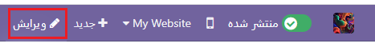
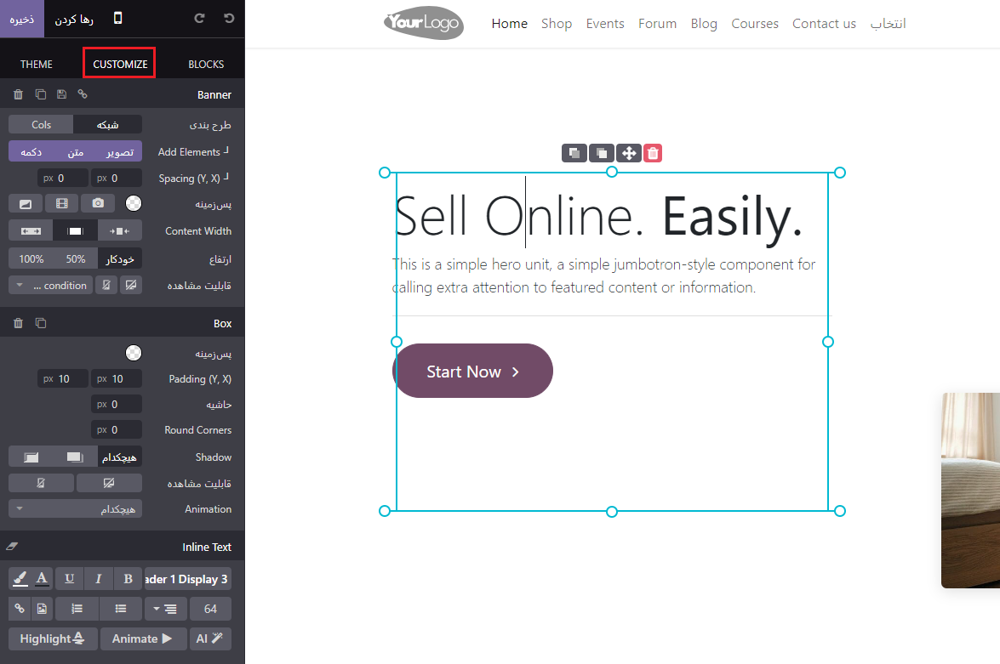
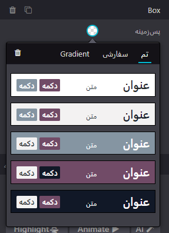
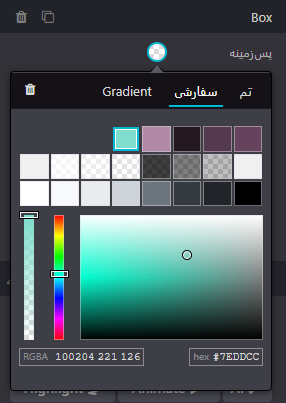
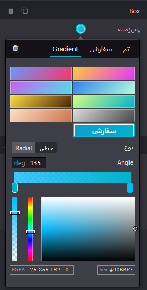
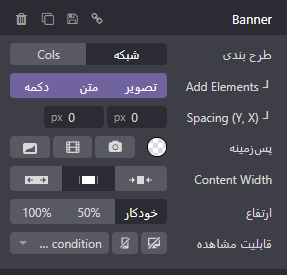
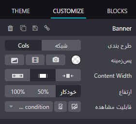

:nosearch:
:show-content:
:hide-page-toc:
:show-toc:

====================
بلوک های ساختمان
====================

بلوک های ساختمانی به شما این امکان را می دهند که وب سایت خود را با کشیدن و رها کردن آنها در صفحات وب خود به سرعت طراحی کنید. چهار نوع بلوک ساختمانی بسته به کاربرد آنها موجود است:

1.	ساختار  
2.	ویژگی‌ها 
3.	محتوای پویا  
4.	محتوای داخلی 

اضافه کردن یک بلوک ساختمانی
---------------------

برای افزودن یک بلوک ساختمانی به صفحه وب سایت خود، ابتدا باید وارد بخش ویرایش صفحه شوید. سپس بلوک ساختمان مورد نظر را انتخاب کنید و آن را با استفاده از کلیک و کشیدن به صفحه خود رها کنید. می‌توانید هر تعداد بلوک که لازم است، به صفحه اضافه کنید.

برای ویرایش محتوای یک بلوک ساختمانی، ابتدا روی آن کلیک کنید. سپس به تب "Customize" بروید، جایی که می‌توانید ویژگی‌های موجود را برای بلوکی که انتخاب کرده‌اید، تغییر دهید.

رنگ از پیش تعیین شده و پس زمینه
---------------

برای اعمال تنظیمات رنگی به بلوک‌های ساختمانی، ابتدا یک بلوک ساختمانی را انتخاب کنید. سپس به تب "Customize" بروید و روی دکمه "Background" کلیک کنید. در اینجا می‌توانید یک Preset رنگی را انتخاب کنید.

وقتی یک پیش‌تنظیم رنگ را تغییر می‌دهید، همه عناصری که از آن استفاده می‌کنند به طور خودکار به روز می‌شوند تا با پیکربندی جدید مطابقت داشته باشند.

چیدمان: شبکه و ستون
--------------------------

برای تغییر طرح‌بندی پیش‌فرض بلوک‌های ساختمانی، به تب "Customize" بروید. در بخش بنر، امکان انتخاب بین دو سبک چیدمان، یعنی شبکه و ستون (شکل) وجود دارد. با انتخاب یکی از این گزینه‌ها، طرح‌بندی بلوک ساختمانی تغییر می‌کند.

توری
------------------

طرح بندی Grid به شما اجازه می دهد تا با کشیدن و رها کردن عناصر، مانند تصاویر یا متن، آنها را تغییر دهید و اندازه آنها را تغییر دهید.

سرهنگ ها
-------------------

انتخاب طرح Cols به شما امکان می دهد تعداد عناصر در هر خط را در بلوک تعیین کنید.

.. Note:: 
    در دستگاه های تلفن همراه، تنها یک عنصر در هر ستون به طور پیش فرض برای دید بهتر استفاده می شود. می توانید این مقدار را با استفاده از حالت پیش نمایش موبایل تنظیم کنید 

کپی کردن یک بلوک ساختمانی
---------------------

با کلیک بر روی نماد تکراری می توانید یک بلوک ساختمان را کپی کنید. پس از تکرار، بلوک جدید در وب سایت شما در زیر بلوک اصلی ظاهر می شود.

سفارش مجدد یک بلوک ساختمانی
--------------------------

برای مرتب کردن مجدد یک بلوک ساختمانی، آن را انتخاب کنید و روی فلش بالا کلیک کنید تا قبل از بلوک قبلی منتقل شود یا روی فلش پایین کلیک کنید تا بعد از آن حرکت کنید.

دید
--------------

قابلیت مشاهده روی دسکتاپ/موبایل
----------------

بسته به دستگاه بازدید کننده می توانید عناصر خاصی را پنهان کنید. برای انجام این کار، عنصر مورد نظر برای مخفی کردن را انتخاب کنید و در تب سفارشی کردن ، به پایین بروید و به Visibility بروید و روی Show/Hide on Mobile یا Show/Hide on Desktop کلیک کنید .

.. Note:: 
    روی نماد تلفن در بالای پیکربندی کلیک کنید تا پیش‌نمایش ظاهر وب‌سایت شما در دستگاه تلفن همراه را مشاهده کنید.

دید مشروط
----------------

همچنین می توانید بلوک های ساختمان را با استفاده از شرایط دیگر پنهان یا نشان دهید. برای انجام این کار، یک عنصر را انتخاب کنید، به Visibility بروید ، روی No condition کلیک کنید و به جای آن Conditionally را انتخاب کنید . سپس، با انتخاب Visible for یا Hidden for و اینکه کدام رکوردهاwill be affected, configure the condition(s) to apply

عناصر نامرئی
-----------------

بسته به تنظیمات دید، برخی از عناصر می توانند از نمای فعلی شما پنهان شوند. برای اینکه یک بلوک ساختمان دوباره قابل مشاهده باشد، به قسمت Invisible Elements در پایین پیکربندی بروید و یک بلوک ساختمانی را انتخاب کنید.

ذخیره یک بلوک ساختمانی سفارشی
----------------------

شما می توانید یک بلوک ساختمانی سفارشی شده را ذخیره کرده و در جای دیگری دوباره از آن استفاده کنید. برای انجام این کار، آن را انتخاب کنید، به تب Customize بروید و روی نماد فلاپی دیسک کلیک کنید تا آن را ذخیره کنید.

بلوک های ساختمانی ذخیره شده در the partسفارشی تب Blocks are available. Click on the pen icon to edit their name.

.. toctree::
   :titlesonly:

   ./dynamic-content
   ./inner-content
   ./structure
   
