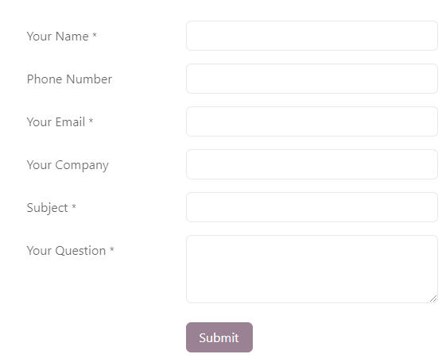
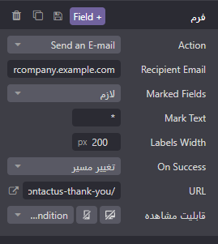
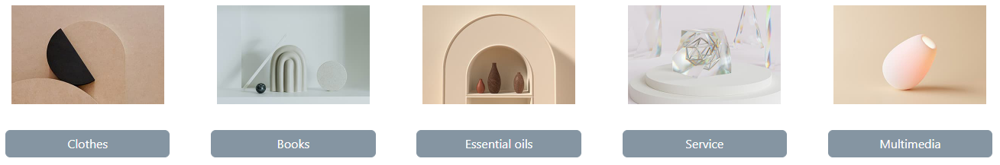

:nosearch:
:show-content:
:hide-page-toc:
:show-toc:

====================
محتوای پویا
====================

بلوک‌های ساختمانی محتوای پویا، ابزارهایی هستند که به شما اجازه می‌دهند محتوای تعاملی و بصری مانند فرم‌ها، محصولات، کد‌های جاسازی یا پست‌های وبلاگ را به صفحات وب خود اضافه کنید. این بلوک‌ها به شما امکان می‌دهند تا طرح‌بندی‌های جذاب و تعاملی را برای وب‌سایت خود ایجاد کنید.

.. Note::
    برای افزودن یک بلوک ساختمانی، ابتدا روی "ویرایش" کلیک کنید، سپس بلوک ساختمانی مورد نظر را در زیر تب "Blocks" انتخاب کرده و آن را بکشید و رها کنید. برای دسترسی به تنظیمات آن، روی آن کلیک کنید و به تب "Customize" بروید، جایی که گزینه‌های موجود به نوع بلوک انتخاب شده بستگی دارد.

فرم
-------

بلوک Form برای جمع آوری اطلاعات از بازدیدکنندگان وب‌سایت و ایجاد رکورد در پایگاه داده شما استفاده می‌شود. این بلوک به شما امکان می‌دهد تا فرم‌های تعاملی را در وب‌سایت خود ایجاد کنید تا کاربران بتوانند اطلاعات خود را وارد کرده و ارسال کنند. اطلاعاتی که توسط این فرم‌ها جمع آوری می‌شوند می‌تواند در پایگاه داده شما ذخیره شود، که این امکان به شما کمک می‌کند تا اطلاعات را مدیریت و تجزیه و تحلیل کنید و بازدیدکنندگان خود را بهتر بشناسید.

در بخش "Form" و تب "Customize"، شما می‌توانید اقدامات دیگری را که می‌خواهید برای انجام دادن پس از ارسال فرم انجام شود، انتخاب کنید. این اقدامات معمولاً بسته به برنامه‌های نصب شده در پایگاه داده شما متغیر است. برخی از اقداماتی که ممکن است برای شما مفید باشند عبارتند از:

- درخواست شغل (استخدام)
- ایجاد مشتری (تجارت الکترونیک)
- ایجاد یک بلیط (Helpdesk)
- ایجاد فرصت (CRM)
- اشتراک در خبرنامه (ایمیل مارکتینگ)
- ایجاد یک کار (پروژه)

با استفاده از فیلد "Action" در بخش "Form"، می‌توانید اقدام مورد نظر خود را انتخاب و پیکربندی کنید.

با استفاده از فیلد "URL" در بخش "On Success" می‌توانید مسیر هدایت کاربران پس از ارسال فرم را تغییر دهید. اگر می‌خواهید کاربران را به یک صفحه تشکر هدایت کنید، آدرس آن صفحه را در این فیلد وارد کنید. همچنین، اگر می‌خواهید کاربران را در صفحه فرم بگذارید و هیچ عملیاتی بلافاصله پس از ارسال انجام نشود، می‌توانید گزینه "Nothing" را انتخاب کنید. همچنین، می‌توانید گزینه "Show Message" را انتخاب کنید تا پیامی برای کاربران نمایش داده شود و آنها را در صفحه فرم بگذارید.

برای افزودن یک فیلد جدید به فرم، ابتدا روی دکمه "+" کنار بخش "Form" یا "Field" در بخش "Customize" کلیک کنید. سپس، از فیلد "Type" استفاده کنید و گزینه‌ای را در زیر عنوان "Custom Field" انتخاب کنید. با انتخاب این گزینه، می‌توانید یک فیلد سفارشی ایجاد کنید که به نیازهای خاص شما پاسخ دهد.

همچنین، شما می‌توانید یک فیلد موجود از پایگاه داده خود انتخاب کرده و از داده‌های موجود در آن استفاده کنید. فیلدهای موجود بر اساس پایگاه داده‌هایی که شما دارید و انتخاب می‌کنید، قابل دسترسی هستند. همچنین، شما می‌توانید از فیلدهای ویژگی اضافه شده به پایگاه داده نیز استفاده کنید، که این امکان به شما کمک می‌کند تا اطلاعات موجود را به صورت جامعتر و کارآمدتر در فرم‌های خود استفاده کنید.

محصولات
--------------

بلوک محصولات پس از نصب برنامه تجارت الکترونیک در دسترس است و برای نمایش مجموعه‌ای از محصولاتی که در وب‌سایت شما فروخته شده‌اند، استفاده می‌شود. این بلوک به شما امکان می‌دهد تا محصولات خود را به صورت جذاب و کارآمد برای بازدیدکنندگان نمایش دهید و آنها را به خرید و مشاهده جزئیات بیشتر ترغیب کنید. از طریق تنظیمات مربوطه، می‌توانید نحوه نمایش محصولات، فیلترها، مرتب‌سازی و سایر ویژگی‌ها را شخصی‌سازی کنید تا به بهترین شکل ممکن با نیازهای وب‌سایت خود هماهنگ شود.

بلوک جدیدترین محصولات به طور پیش‌فرض محصولات جدیدتری که به وب‌سایت اضافه شده‌اند را نمایش می‌دهد. اما شما می‌توانید با تغییر تنظیمات، نحوه نمایش محصولات را تغییر دهید.

برای تغییر محصولاتی که نمایش داده می‌شوند، می‌توانید به بخش محصولات در برگه سفارشی‌سازی بروید و گزینه "محصولات اخیراً فروخته شده" یا "محصولات اخیراً مشاهده شده" را انتخاب کنید. با این کار، محصولاتی که به تازگی فروخته شده یا مشاهده شده‌اند نمایش داده می‌شوند.

علاوه بر این، می‌توانید با انتخاب یک دسته خاص از محصولات، فقط محصولات مرتبط با آن دسته را نمایش دهید. برای این کار، با استفاده از فیلد "Category" می‌توانید دسته مورد نظر خود را انتخاب کرده و فقط محصولاتی که به آن دسته تعلق دارند را نمایش دهید.