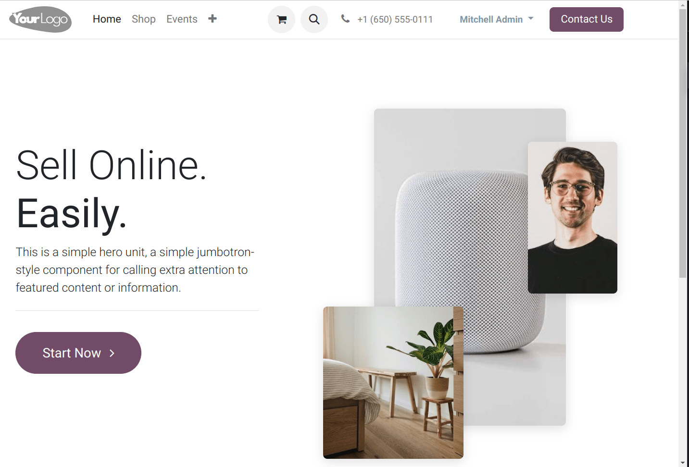
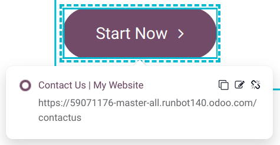
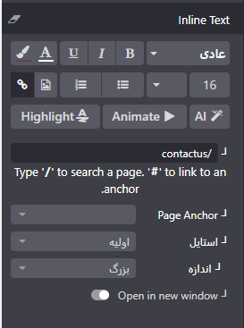

:nosearch:
:show-content:
:hide-page-toc:
:show-toc:

====================
ساختار
====================

پیکربندی وب‌سایت شما انواع گسترده‌ای از بلوک‌های ساختاری را برای طراحی طرح بندی وب‌سایت فراهم می‌کند، از جمله بلوک‌های سرفصل، تصاویر و متن. در زیر، دو نوع اصلی از بلوک‌های ساختاری را می‌توانید مشاهده کنید:

1. Banner 
2. Masonry

.. Note::
    برای افزودن یک بلوک ساختمانی، ابتدا روی "ویرایش" کلیک کنید. سپس، بلوک ساختمان مورد نظر خود را در زیر تب "Blocks" انتخاب کرده و آن را بکشید و روی صفحه رها کنید. برای دسترسی به تنظیمات آن، روی آن کلیک کنید و به تب "Customize" بروید. در اینجا، می‌توانید تنظیمات مختلفی را برای بلوک خود انجام دهید و آن را به شکل دلخواه خود شخصی‌سازی کنید.

Banner
-------------

بلوک بنر یکی از بلوک‌های ساختمانی است که عنوان، متن، تصاویر و یک دکمه فراخوان را ترکیب می‌کند. این بلوک معمولاً برای قرار دادن در بالای یک وب‌سایت مناسب است و به کاربران کمک می‌کند تا با اطلاعات اصلی و مهم وب‌سایت شما آشنا شوند. از این بلوک می‌توانید برای جلب توجه کاربران، ارائه پیام‌های مهم و تبلیغات استفاده کنید.

فراخوانی برای اقدام
-----------------

دکمه تماس برای اقدام به بازدیدکنندگان وب‌سایت شما امکان می‌دهد تا اقدام خاصی را انجام دهند، مانند مشاوره با فروشگاه شما، دانلود یک فایل، یا تعیین وقت برای ملاقات. این دکمه‌ها به شما کمک می‌کنند تا ارتباط بیشتری با کاربران برقرار کنید و آن‌ها را به انجام اقدامات مشخصی ترغیب کنید. از این دکمه‌ها به عنوان یک ابزار ارتباطی و اقدام‌محور برای ارتباط با مخاطبانتان استفاده کنید و از آن‌ها برای بهبود تجربه کاربری و افزایش نرخ تبدیل استفاده کنید.

برای تغییر پیوند دکمه، ابتدا دکمه مورد نظر را انتخاب کنید. سپس روی نماد "Edit Link" کلیک کنید. با این کار، یک پنجره جدید باز خواهد شد که شما می‌توانید در آن پیوند مورد نظر خود را وارد کنید. همچنین، در بخش "Inline Text" می‌توانید گزینه‌های سفارشی‌سازی اضافی را مشاهده کنید که به شما امکان می‌دهد متن دکمه را به شکل دلخواه خود تغییر دهید.

بلوک Masonry یک مجموعه گسترده از الگوها را ارائه می‌دهد که به شما امکان می‌دهد آجرهای تصویر و متن را به هم مرتبط کنید. برای تغییر الگوی پیش‌فرض، می‌توانید به تب "Customize" بروید، سپس روی "Template" کلیک کنید و یکی از الگوها را انتخاب کنید. این الگوها به شما کمک می‌کنند تا ظاهر وب‌سایت خود را به شکلی منحصر به فرد و جذابتر ترتیب دهید.

.. Note::
    نکته: بلوک Masonry به شما این امکان را می‌دهد که متن را در بالای تصاویر اضافه کنید. برای انجام این کار، به تب "Customize" بروید، سپس به "Add Elements" بروید و روی "Text" کلیک کنید. با افزودن متن به این بلوک، می‌توانید اطلاعات بیشتری را به کاربران ارائه دهید و تجربه مشاهده وب‌سایت را بهبود بخشید.
