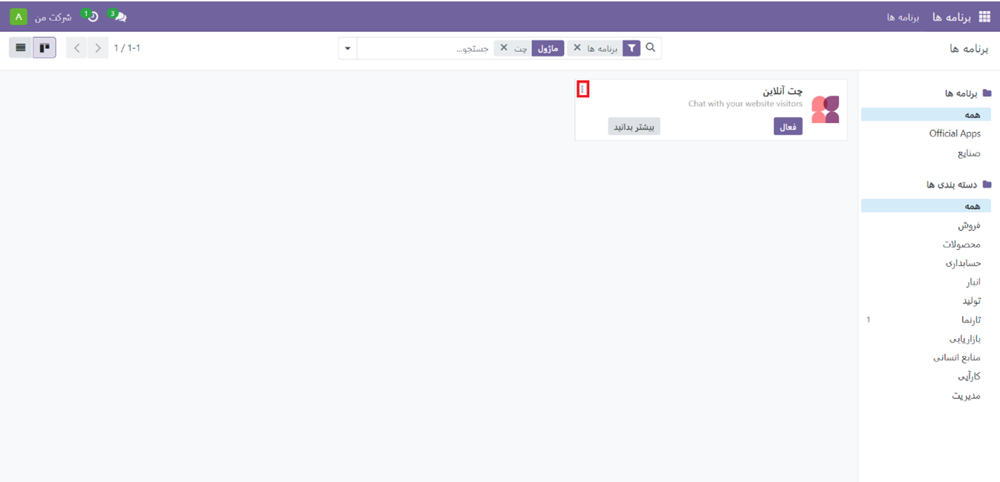
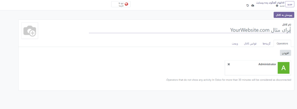
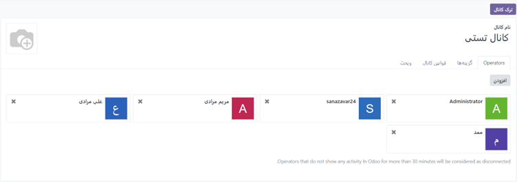
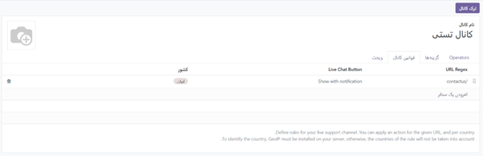

:nosearch:

ماژول چت آنلاین
=============

ماژول چت آنلاین، به کاربران این امکان را می‌دهد که در زمان واقعی با بازدیدکنندگان وب‌سایت ارتباط برقرار کنند. این ابزار، به مدیران اجازه می‌دهد تا به سوالات پشتیبانی سریعاً پاسخ دهند و مسائل را برای بررسی یا پیگیری بیشتر به تیم مربوطه هدایت کنند. در واقع، چت آنلاین فرصتی ارزشمند برای دریافت بازخورد فوری از مشتریان ارائه می‌دهد.

نحوه فعال کردن چت آنلاین 
------------------

برای فعال کردن چت آنلاین، به سادگی کافی است که به منوی سمت راست بالای صفحه نگاه کنید و بر روی مربع منو کلیک کنید. سپس، به بخش "برنامه‌ها" بروید و ماژول چت آنلاین را پیدا کنید. با کلیک بر روی آن، گزینه "فعال" را انتخاب کنید. (توجه کنید که اگر نیاز به غیرفعال کردن این ماژول داشتید، می‌توانید روی سه نقطه سمت چپ که با کادر قرمز مشخص شده‌اند کلیک کرده و سپس روی "حذف نصب" کلیک کنید.)

**نکته: پس از نصب برنامه چت آنلاین، به طور پیش‌فرض یک کانال چت آنلاین ایجاد می‌شود.**

برای ایجاد یک کانال چت آنلاین جدید، ابتدا به داشبورد اصلی بروید (در بالای سمت راست). سپس، چت آنلاین را انتخاب کنید و بر روی دکمه "جدید" کلیک نمایید. با این کار، یک فرم جزئیات کانال خالی به شما نمایش داده می‌شود. در این مرحله، نام مورد نظر برای کانال جدید را در قسمت "نام کانال" وارد نمایید.

**نکته: با مراجعه به داشبورد کانال‌های چت آنلاین وب‌سایت، از طریق بردکرامب بالای صفحه، می‌توانید به فرم جزئیات کانال برای هر کانالی دسترسی پیدا کنید. کارت کانال مربوطه را پیدا کرده و نشانگر موس را روی آن نگه دارید، سپس روی نماد ⋮ (سه نقطه) کلیک کنید تا منوی کشویی باز شود. سپس، روی "Configure Channel" کلیک کنید تا فرم جزئیات کانال باز شود**
برای پیکربندی برگه‌های باقی‌مانده در فرم جزئیات کانال (اپراتورها، گزینه‌ها، قوانین کانال و ویجت)، مراحل زیر را دنبال کنید:

تب اپراتورها
------------------
اپراتورها کاربرانی هستند که به عنوان نماینده عمل می‌کنند و به درخواست‌های چت آنلاین مشتریان پاسخ می‌دهند. هنگامی که کاربر به عنوان اپراتور در یک کانال چت آنلاین اضافه می‌شود، می‌تواند چت را از بازدیدکنندگان وب‌سایت در هر کجای پایگاه داده دریافت کند و پنجره‌های چت در گوشه سمت راست پایین صفحه باز می‌شود.
با توجه به تصویر زیر، در فرم جزئیات کانال، روی تب "Operators" کلیک کنید.
**نکته: کاربری که کانال چت آنلاین را ایجاد کرده است به طور پیش فرض به عنوان اپراتور اضافه شده است.**

برای افزودن اپراتور جدید، می‌توانید از دکمه "افزودن" در بالا سمت راست استفاده کنید. همچنین، اپراتورهای فعلی را می‌توانید با کلیک بر روی کادرهای مربوطه آنها در تب "Operators" ویرایش یا حذف کنید، مانند عکس زیر.

.. image:: ./src/img/operatorsTab1.png
    :alt: کانال جدید
    :align: center

در حالت جستجو، برای یافتن کاربران مورد نظر، می‌توانید اسکرول کنید یا نام آنها را در نوار جستجو وارد کنید. سپس، بر روی کادر کنار کاربرانی که قرار است اضافه شوند، کلیک کرده و روی "Select" کلیک کنید.

همچنین، اپراتورهای جدید را می‌توانید مستقیماً با استفاده از مدال افزودن و به لیست اضافه کنید.

.. image:: ./src/img/operatorsTab2.png
    :alt: کانال جدید
    :align: center

همچنین با کلیک بر روی جدید و پر کردن فرم ایجاد اپراتورها میتوان اپراتور جدید اضافه کرد. 

.. image:: ./src/img/operatorsTab3.png
    :alt: کانال جدید
    :align: center

تب "Options" یا گزینه‌ها در فرم جزئیات کانال چت آنلاین، شامل تنظیمات تصویری و متنی برای پنجره چت آنلاین است. 

دکمه LiveChat Button نمادی است که در گوشه پایین وب سایت ظاهر می شود.
در قسمت "notification text" متنی را وارد کنید که هنگامی که دکمه چت آنلاین در وب‌سایت ظاهر می‌شود، تبریکی را نمایش دهد و حباب متن را به‌روز کند.
برای تغییر رنگ دکمه چت آنلاین که در وب‌سایت ظاهر می‌شود، از قسمت رنگ استفاده کنید. ابتدا روی دایره رنگی کلیک کنید تا پنجره انتخاب رنگ باز شود، سپس دایره را در امتداد شیب رنگ بکشید تا رنگ مورد نظر را انتخاب کنید. پس از تکمیل، بر روی پنجره انتخاب کلیک کنید تا تغییرات ذخیره شود. برای بازنشانی رنگ به حالت پیش‌فرض، روی نماد 🔁 (رفرش) در سمت راست حباب‌های رنگی کلیک کنید.

**به منظور انتخاب رنگ برای دکمه یا هدر، می‌توانید از یکی از روش‌های زیر استفاده کنید:
1. استفاده از نوار لغزنده: با استفاده از نوار لغزنده، می‌توانید رنگ مورد نظر را به صورت دستی انتخاب کنید. با کشیدن نوار به سمت رنگ مورد نظر، رنگ تغییر می‌یابد.
2. ورودی کد رنگ: می‌توانید کد رنگ RGB، HSL، یا HEX مورد نظر را به صورت دستی وارد کنید تا رنگ مطلوب را انتخاب کنید.
3. استفاده از حباب‌های رنگی: با کلیک روی هر یک از حباب‌های رنگی در پنجره انتخاب رنگ پاپ‌آپ، می‌توانید رنگ مورد نظر خود را انتخاب کنید. این حباب‌ها معمولاً به صورت نمونه‌ای از رنگ‌های مختلف نمایش داده می‌شوند.
توجه داشته باشید که گزینه‌های مختلفی برای انتخاب رنگ ممکن است بسته به سیستم عامل شما در دسترس باشد.**

Livechat online
-------------

پنجره چت آنلاین فضایی است که در آن گفتگوی چت آنلاین با بازدیدکنندگان وب سایت انجام می شود.
برای تغییر پیامی که بازدیدکننده هنگام باز کردن یک جلسه گپ جدید می‌بیند، پیام خوش‌آمدگویی را ویرایش کنید. این پیام باید به نظر برسد که توسط یک اپراتور چت آنلاین ارسال شده است، و به عنوان یک تبریک و یک دعوت برای ادامه مکالمه عمل کند.
برای تغییر متنی که در کادری که بازدیدکنندگان پاسخ‌های خود را تایپ می‌کنند ظاهر می‌شود، "Chat Input Placeholder" را ویرایش کنید. این پیام از بازدیدکننده می‌خواهد که چت را آغاز کند.
سربرگ کانال نوار رنگی در بالای پنجره چت قرار دارد. می‌توانید رنگ هدر کانال را با استفاده از همان مراحلی که برای تغییر دکمه چت آنلاین انجام دادید، تغییر دهید.

برگه قوانین کانال
--------------

برگه "قوانین کانال" در فرم جزئیات کانال چت آنلاین، با پیکربندی زمانی که یک اقدام "URL Regex" فعال می‌شود مانند بازدید از صفحه، تعیین می‌کند که چه زمانی پنجره چت آنلاین در وب‌سایت باز می‌شود.

.. toctree::
    website/online_chat.rst